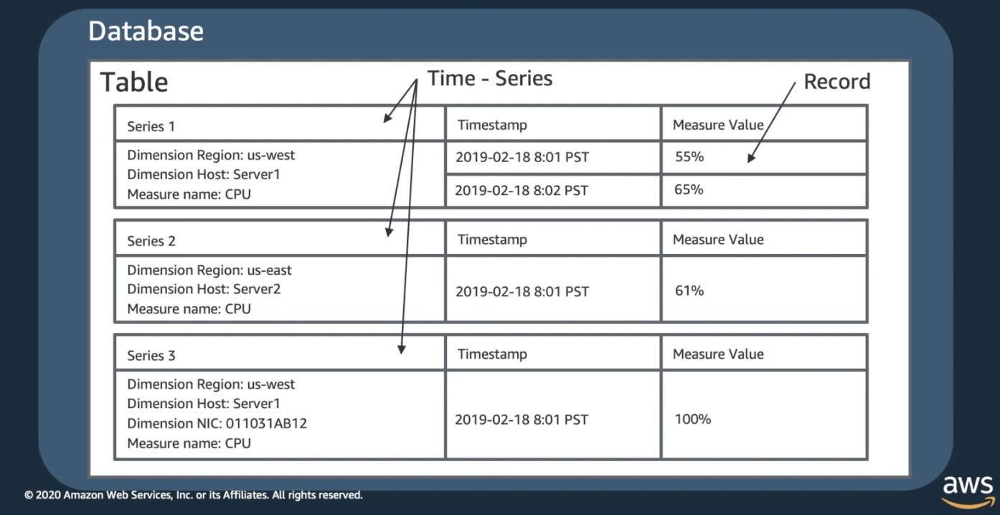

# Amazon Timestream

[Amazon Timestream](https://aws.amazon.com/timestream/)

> Amazon Timestream is a fast, scalable, and serverless time series database service for IoT and operational applications that makes it easy to store and analyze trillions of events per day up to 1,000 times faster and at as little as 1/10th the cost of relational databases.

[AWS Black Belt Online Seminar】Amazon Timestream](https://www.youtube.com/watch?v=_j6YIke6lnU)

- 時系列データとは
  - 時間経過とともに変化する事象を測定するために、タイムスタンプとともに記録されたシーケンスデータ
  
- Amazon Timestreamの特徴
  - サーバレス
  - コスト最適化
  - スケーラブル
  - 時系列専用
  - 常時暗号化とアクセス制御
  
- Amazon Timestream アーキテクチャ

